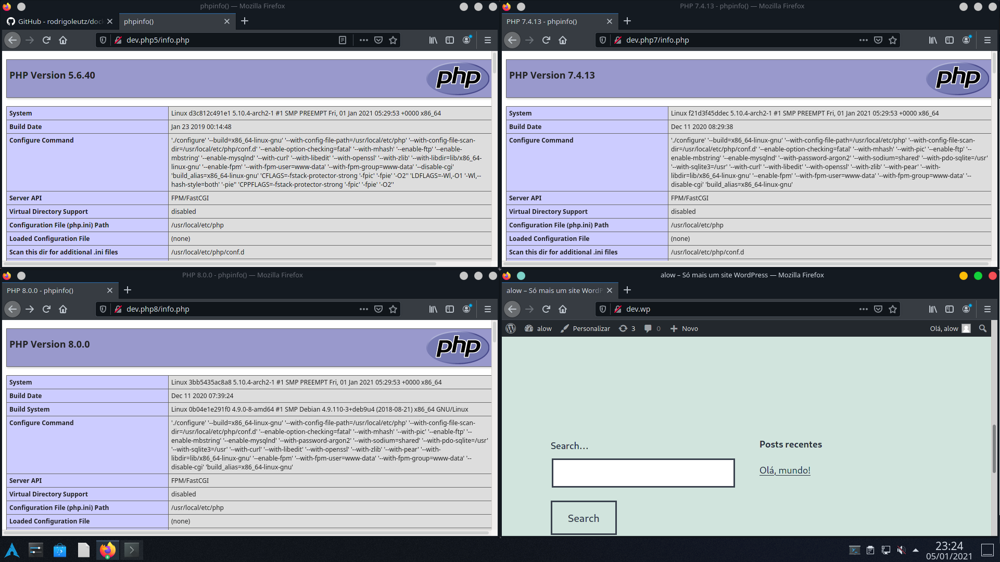

# docker-webdev
Docker for PHP programming.

<pre>
Author:		Rodrigo Leutz
License:	GPL v2.0
</pre>

-------------------------------------------

<h2>Instructions:</h2>

<h3>Install</h3>
<h5>Arch Linux / Fedora / Ubuntu</h5>
<pre>
./install-hosts.sh
</pre>
 
<h3>Update</h3>
<pre>
./update.sh
</pre>
 
<h3>Activate</h3>
<pre>
./activate.sh
</pre>
 
<h3>Deactivate</h3>
<pre>
./deactivate.sh
</pre>
 
<h3>Backup</h3>
<pre>
./backup.sh
</pre>
Make a backup of database.
 

-------------------------------------------

<h3>Para utilizar acesse no navegador:</h3>

- PHP 5.6: http://dev.php5

- PHP 7.4: http://dev.php7

- PHP 8.0: http://dev.php8

- Wordpress: http://dev.wp

- phpMyAdmin: http://dev.phpmyadmin
<pre>
-- Hosts: db
          db-backup

-- User: root
-- Password: senha123
</pre>

- Mysql: 
<pre>
	sudo docker exec -it db mysql -u root -psenha123
	sudo docker exec -it db-backup mysql -u root -psenha123
</pre>

<h3>Path</h3>
<pre>
├── activate.sh = Activate script
├── backup = Backup folder
│   ├── files = Backup files
│   │   └── README.md
│   ├── logs = Backup Logs
│   │   └── README.md
│   └── README.md
├── backup.sh = Backup script
├── deactivate.sh = Deactivate script
├── img
│   └── php-docker.png
├── install-hosts.sh
├── LICENSE
├── public
│   ├── dev-php5 = PHP 5.6 server files
│   │   ├── index.php
│   │   └── info.php
│   ├── dev-php7 = PHP 7.4 server files
│   │   ├── index.php
│   │   └── info.php
│   ├── dev-php8 = PHP 8 server files
│   │   ├── index.php
│   │   └── info.php
│   └── wordpress = Wordpress server files
│       └── info.php
├── README.md = This file
├── update.sh = Update script
└── webdev
    ├── build = Dockerfiles
    │   ├── php5-fpm
    │   │   └── Dockerfile
    │   ├── php7-fpm
    │   │   └── Dockerfile
    │   └── php8-fpm
    │       └── Dockerfile
    ├── database = Database server files
    │   ├── backup = Database backup server
    │   │   └── README.md
    │   ├── master = Database master server
    │   │   └── README.md
    │   └── README.md
    ├── docker-compose.yaml = docker-compose file
    └── nginx
        ├── conf = NGINX server config
        │   ├── nginx.conf
        │   └── snippets
        │       └── fastcgi-php.conf
        ├── defaults = Default server config file
        │   └── defaults.conf
        ├── logs = Servers logs
        │   └── README.md
        └── sites = NGINX servers config files
            ├── dev-php5.conf
            ├── dev-php7.conf
            ├── dev-php8.conf
            ├── phpmyadmin.conf
            └── wp-dev.conf
</pre>
